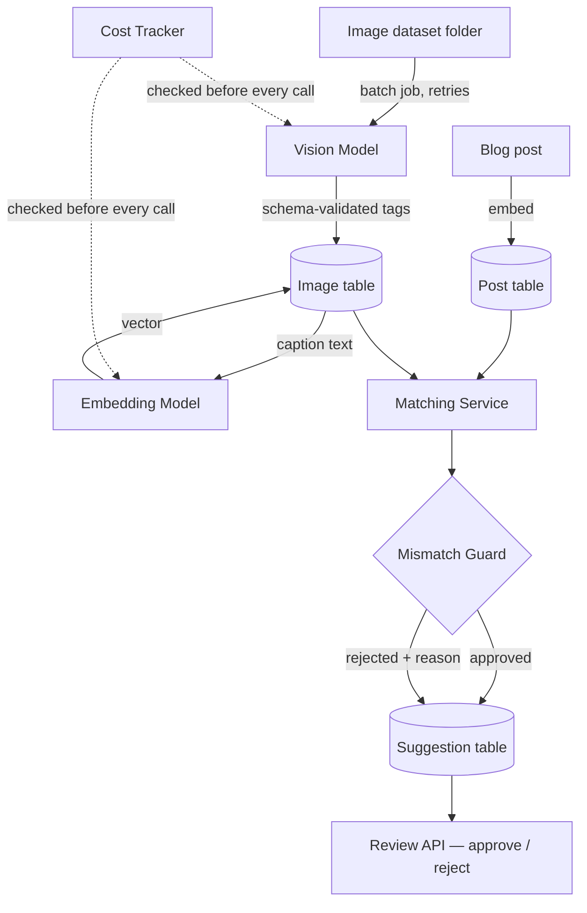

# Image Matching Engine

Understands what's actually in an image library, tags it, and matches the right image to the right blog post based on meaning, not filenames or keywords. A post about red foxes gets the red-fox photo, never the similar-looking wolf. When no image is a good enough match, the system says so instead of guessing.

Built independently as a portfolio project (FlyRank Backend AI Engineering internship capstone brief, built outside FlyRank's
submission process).

## Status

All 4 phases complete, verified with real evidence see `EVIDENCE.md` for pasted proof of every claim below, and `BUILDLOG.md` for an honestaccount of what broke along the way and how it was fixed.

## What it does

1. A background batch job sends every image to a vision model (Gemini), extracting structured tags subject, category,
   attributes, caption, confidence validated against a strict schema. Nothing the model returns is trusted blindly; low-confidence resultsare flagged, not silently accepted as normal.
2. Each image's caption and each blog post's content are embedded into the same semantic space, so matching works on meaning, not keyword overlap ("red fox" correctly matches a post about "Vulpes vulpes").
3. For a given post, candidate images are ranked by similarity, then every candidate is checked by a **mismatch guard**: is the vision model's confidence high enough? Does the category actually match what the post is about? Is the similarity score above threshold? Only if all three pass does a suggestion get approved otherwise it's rejected with a specific, human-readable reason.
4. If nothing clears the bar, the system says so explicitly rather than forcing a wrong image through.
5. Every AI call's cost is logged, with a hard budget cap that gracefully defers remaining work — proven live, not just described (see `EVIDENCE.md`).
6. A small review API lets suggestions be approved or rejected, and a hand-labeled evaluation set produces a real top-1 precision number.

## Architecture



- **HTTP layer** — Express routes (`src/routes/`)
- **Service layer** — vision, embeddings, matching, the guard, cost tracking (`src/lib/`)
- **Background jobs** — vision batch and embedding batch run fire-and-forget, off the request path, with retries that honor the
  API's own suggested wait time on rate limits rather than a blind fixed backoff
- **Data layer** — PostgreSQL via Prisma

No Redis or job queue — unlike a scheduling-heavy system, this onl needs a batch job that runs once triggered, not jobs scheduled for a future time, so a simpler in-process background task was the right call here.

## Running it

```bash
git clone https://github.com/shereef-M/image-matching-engine.git
cd image-matching-engine
npm install
docker compose up -d
cp .env.example .env   # fill in a free Gemini key from aistudio.google.com
npx prisma migrate dev
npm run dev
```

Then, in another terminal:

```bash
npx tsx src/scripts/seed-images.ts      # registers the dataset in the DB
curl -X POST http://localhost:3000/images/process   # vision tagging
curl -X POST http://localhost:3000/images/embed     # embeddings
npx tsx src/scripts/run-eval.ts         # real top-1 precision number
```

Create a post and see it match:

```bash
curl -X POST http://localhost:3000/posts \
  -H "Content-Type: application/json" \
  -d '{"title":"The Behavior of Red Foxes","body":"..."}'

curl http://localhost:3000/posts/<id>/suggestions
```

## Results

- **12/12 (100%) top-1 precision** on a 12-post hand-labeled eval set, after tuning the similarity threshold against real diagnostic data (see `BUILDLOG.md` for the reasoning this wasn't a guess).
- All 6 of the brief's core acceptance probes verified live: correct top match, category-mismatch rejection (the wolf-on-a-fox-post case), no-confident-match refusal, low-confidence flagging, and semantic matching across different wording for the same concept.
- 48 images fully processed for **$0.1518** total, tracked per call, zero cost-tracking gaps.
- Budget guard proven live: a real $0.16 cap correctly deferred 12 images with zero API calls made and zero crash, then recovered cleanly once budget was restored.
- Near-duplicate check: zero found across all 1,128 possible pairs in the 48-image corpus — a clean negative result, not a failure of the check itself.

## Limitations

- **"Correct" in the eval set means the right category**, not "this one specific image out of ~12 interchangeable photos." The dataset is generic category photos, not images shot for individual posts, so per-post single-image ground truth isn't meaningful here — this is a deliberate, documented scoping decision, not an oversight.
- **Category inference always picks the closest of the 4 known categories**, even for posts unrelated to any of them (a post about jazz history gets inferred as "wolf," the least-wrong of four bad options). The similarity threshold still correctly prevents a bad match in these cases — the category label itself just isn't meaningful for genuinely out-of-domain posts.
- **12 self-authored eval examples** is a real, honest result on this dataset — not a claim that generalizes to arbitrary unseen posts at scale.
- Fallback image generation and a second AI agent for human-in-the-loop QA (both listed as optional stretch goals in the brief) were deliberately not built — genuine scope jumps that didn't seem to earn their complexity for this project's goals.
